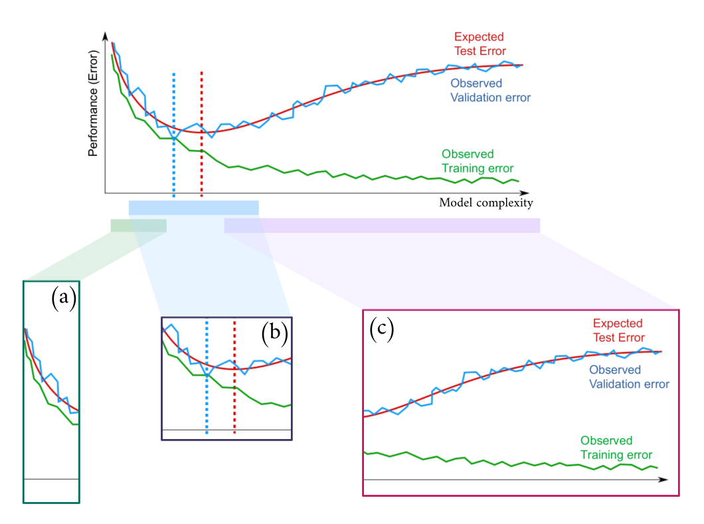

# Assignment 1

The assignment is split into two parts: you are asked to solve a regression problem and answer some questions.

You can use all the books, material, and help you need.
Remember that the questions you are asked are similar to those you may find in the final exam and are related to essential and fundamental machine learning concepts. As such, you will need to learn them sooner or later to pass the course.
We will give you some feedback afterwards.

## Tasks
You have to solve a regression problem. You are given a set of data consisting of input-output pairs `(x, y)`, where `x` is a bi-dimensional vector, and you have to build a model to fit this data.  We will then evaluate your model's performance on a **different test set**.


To complete the assignment, you must address the tasks below and submit your solution as a zip file on the iCorsi platform. More details are in the Instructions section below.


### T1. Linear Regression
Use the family of models `f(x, theta) = theta_0 + theta_1 * x_1 + theta_2 * x_2 + theta_3 * cos(x_1) + theta_4 * x_2 * x_2 + theta_5 * tanh(x_1) ` to fit the data (File: **data.npz**):
* Write in the report the formula of the model substituting parameters `theta_0, ..., theta_5` with the estimates you've found;
* Evaluate your model's test performance using the mean squared error as a performance measure.
* Implement Lasso Regression, what do you observe? What can you infer about the given family of models?

### T2. Non-Linear Regression
Consider any family of non-linear models of your choice to address the above regression problem (same data as T1):
* Evaluate the test performance of your model using the mean squared error as a performance measure;
* Compare your model with the linear regression of task 1. Which one is **statistically** better?

### T3. (Bonus)

In the [GitHub repository of the course](https://github.com/FatimaEzzedinee/ML-bachelor-course-assignments-sp24), you will find a trained torch model that we built using a **new dataset** you are given (**data_bonus**). This _baseline_ model can achieve an MSE of **0.013** when evaluated on the test set.
You will get extra points if you provide a model of your choice whose test performance is **better** (i.e., the MSE is lower) than ours. Of course, you must also tell us **why** your model is performing better.

To complete the assignment, you must submit a zip file on the iCorsi platform containing the following:

1. A PDF file describing how you solved the assignment, covering all the points described above (at most 2500 words, no code!);
2. The model(s)
3. A Jupyter Notebook containing 2 cells: 1) the source code you used to build, train, and evaluate your model. 2) A cell that should run independently from cell 1 that loads and evaluates your model(s). Please look at the example `./deliverable/example.ipynb`

See below for more details.


## Questions

Motivate all answers, but keep them short. Support the answers with appropriate formulas.


### Q1. Training versus Validation

Assume one of your classmates missed the lecture in which we presented the following figure.
Please explain it in your own words by using technical details and intuition, where appropriate. In particular,

1. What is the whole figure about?
2. Explain the behaviours of the curves in each of the three highlighted sections in the figure, namely (a), (b), and (c);
   1. Can you identify any signs of overfitting or underfitting in the plot? If yes, explain which sections correspond to which concept.
   2. How can you determine the optimal complexity of the model based on the given plot?
3. Is there any evidence of high approximation risk? Why? If yes, in which of the below subfigures?
4. Do you think that increasing the model complexity can bring the training error to zero? And the structural risk?
5. If the X axis represented the training iterations instead, would the training procedure that generated the figure use early stopping? Explain why. (**NB**: ignore the subfigures and the dashed vertical lines)




### Q2. Linear Regression

Consider the following regression problem in which the task is to estimate the target variable `y = g(x) + eta`, where `g(.)` is unknown, `eta ~ N(0, 1)`, and the input variable `x` is a bi-dimensional vector `x = [x_1, x_2]`.
Suppose to have `n` training samples and to fit the data using a linear model family `f(x, theta) = theta_0 + theta_1 * x_1 + theta_2 * x_2`.

Now, we add another regressor (feature) `x_3` (to obtain `f(x, theta) = theta_0 + theta_1 * x_1 + theta_2 * x_2 + theta_3 * x_3`), and we fit a linear model on the same data again. Comment and compare how the (a.) training error, (b.) test error, and (c.) coefficients would change in the following cases:

1. `x_3 = x_1 + 0.2 * x_2`.
2. `x_3 = x_1 ** 2` is the square of `x_1` (in Python `**` is the "power" operator, so ` 3 ** 2 = 3 * 3 = 9`).
3. `x_3` is a random variable independent from `y`.
4. How would your answers change if you were using Lasso Regression?
5. Explain the motivation behind Ridge and Lasso regression and their principal differences.

Motivate your answers.

**NB**: You **don't** have to run any experiment to answer this question. Your answers should be based only on your understanding of linear regression.


### Q3. Logistic Regression

##### 3.1

1. What are the main differences between the logistic-regression and the perceptron?
2. Discuss the major limit they share and how neural networks can solve it.
3. What is the role of activation functions in feedforward neural networks.


### Q4.
Consider the regression problem shown in the picture below and answer each point.


1. Do you think a model of the family f(x, theta) = theta_0 + theta_1 * x_1 + theta_2 * x_2 is a good choice for such task? Why?

2. Do you think using a feed forward neural network would improve the results?


## Instructions

### Tools
Your solution to the regression problem must be entirely coded in `Python 3` ([not `Python 2`](https://python3statement.org/)) using the tools we have seen in the labs.
These include:

- Numpy
- Scikit-learn
- Torch

You can develop your code in Colab, like we saw in the labs, or install the libraries on your machine and develop locally.
If you want to work locally, you can install Python libraries using something like the [Pip](https://pypi.org/project/pip/) package manager. There are plenty of tutorials online.


### Submission

In the [GitHub repository of the course](https://github.com/FatimaEzzedinee/ML-bachelor-course-assignments-sp24), you will find a folder named `Assignment 1`.
The contents of the folder are as follows:

- `Data/`:
    - `data.npz`: a file storing the dataset for Task 1 and 2 in a native Numpy format;
    - `data_bonus.npz`: a file storing the dataset for Task 3 in a native Numpy format;
- `Report Template/`:
   - `report_surname_name.pdf`: an example of the report;
   - `report_surname_name.tex`: the LaTeX source for the provided report pdf;
- `Torch Model/`:
    - `baseline.pt`: a torch file storing our baseline model;
- `example.ipynb`: a working example of how to evaluate our baseline model;


Please note that we also uploaded the data for T1 and T2 online at this [link](https://drive.switch.ch/index.php/s/37RuoA3Mgt9Rqah) and for T3: [link](https://drive.switch.ch/index.php/s/Wp0I2gb33mhERFN)

The `example.ipynb` Notebook loads the data from the links (you can also load them from the data folder), loads a model from the file, and evaluates the model's MSE on the loaded data.

You must submit a zip file with a structure similar to the repository, but:

- The `deliverable` folder must contain the following:
    - `example.ipynb`, edited to work with your models;
    - the saved models for both tasks (linear regression and the model of your choice);
    - any additional (but not necessary) file to load the trained models and evaluate their performance using `example.ipynb`;
- The report must be a pdf file (no need for the `.tex` file) covering both the tasks and the questions.

The file should have the following structure:
```bash
as1_surname_name/
    report_surname_name.pdf
    deliverable/
        example.ipynb
        linear_regression.pickle  # or any other file storing your linear regression
        nonlinear_model.pickle  # or any other file storing your model of choice
```
Remember that we will **only execute** `example.ipynb` to grade your assignment, so ensure everything works out of the box.

We don't accept photos or scans of handwritten answers. We suggest you create your submission in LaTeX (e.g. using [Overleaf](https://www.overleaf.com)) so that any formula you want to write is understandable. Following the `.tex` sample provided is recommended. You can add figures and tables where appropriate.


### Evaluation criteria

You will get a positive evaluation if:

- You demonstrate a clear understanding of the main tasks and concepts;
- You provide a clear description of your solution to the task;
- You provide sensible motivations for your choice of model and hyper-parameters;
- The statistical comparison between models is conducted appropriately;
- Your code runs out of the box (i.e., without us needing to change your code to evaluate the assignment);
- Your code is appropriately commented on;
- Your model has a good test performance on the unseen data;
- Your model has a better test performance than the baseline model provided by us;
- Your answers are complete: all the claims are justified and supported by formulas (where appropriate);
- Your answers are re-elaborating concepts presented in class and not only cut-paste from a book, Wikipedia or a classmate's answer.

You will get an unfavourable evaluation if:

- We realise that you copied your solution (you must explain in your own words so that it's clear that you understood, even if you discuss your solution with others);
- The description of your solution is not clear or is incomplete;
- The statistical comparison between models is not thorough;
- Your code requires us to edit things manually for it to work;
- Your code is not adequately commented on.
